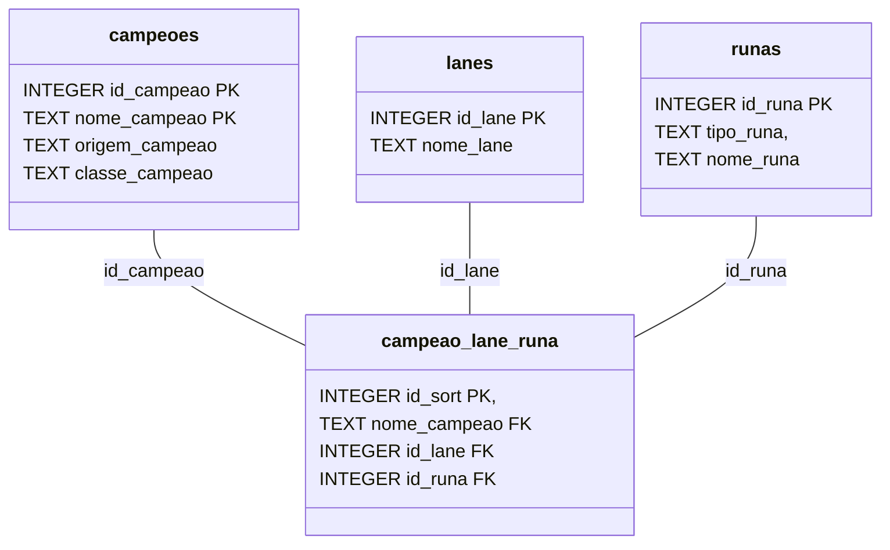

```mermaid
classDiagram
    class campeoes {
        INTEGER id_campeao PK
        TEXT nome_campeao PK
        TEXT origem_campeao
        TEXT classe_campeao
    }
    
    class lanes {
        INTEGER id_lane PK
        TEXT nome_lane
    }
    
    class runas {
        INTEGER id_runa PK
        TEXT tipo_runa,
        TEXT nome_runa
    }
    
    class campeao_lane_runa{
        INTEGER id_sort PK,
        TEXT nome_campeao FK
        INTEGER id_lane FK
        INTEGER id_runa FK
    }
    
    campeoes -- campeao_lane_runa : id_campeao
    lanes -- campeao_lane_runa : id_lane
    runas -- campeao_lane_runa : id_runa
```
